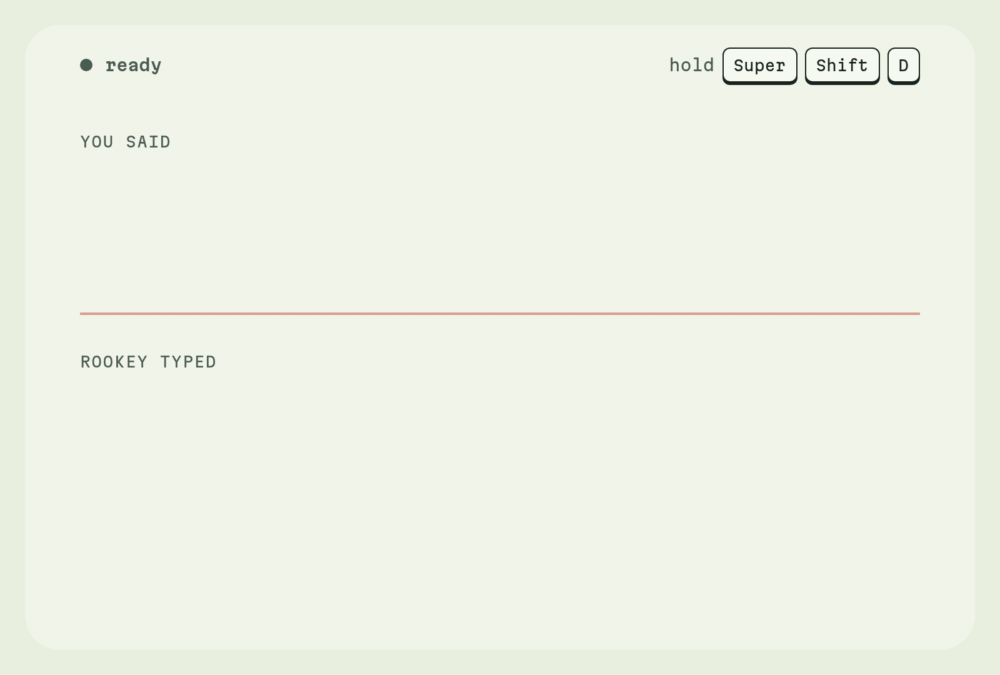

<p align="center">
  <a href="https://rookey.click">
    <picture>
      <source media="(prefers-color-scheme: dark)" srcset="assets/banner-dark.png">
      
    </picture>
  </a>
</p>

<p align="center">
  <a href="https://rookey.click"><b>rookey.click</b></a> ·
  <a href="https://github.com/7KiLL/rookey/releases/latest">Download</a> ·
  <a href="https://rookey.click/docs/">Docs</a> ·
  <a href="#install">Install</a> ·
  <a href="#compared">Compared</a>
</p>

<p align="center">
  <a href="https://github.com/7KiLL/rookey/releases/latest"></a>
  
  <a href="LICENSE"></a>
</p>

Hold a key, talk, let go: the words are typed into whatever window you are in. One Rust binary for Linux, macOS and Windows. It transcribes with your own ElevenLabs key for cents an hour, or with Whisper on your machine for nothing.

<p align="center">
  <picture>
    <source media="(prefers-color-scheme: dark)" srcset="assets/demo-dark.gif">
    
  </picture>
</p>
<p align="center"><sub>Hold the keys, talk, let go. The fillers go, and a name read off your screen comes out as one word.</sub></p>

## Why rookey

Dictation tools make you choose: a subscription whose cloud hears everything you say, or a local script that runs on one desktop. rookey is one binary on three systems, with both engines behind one key.

- **Pay for the minutes you talk.** Your own ElevenLabs key: $0.22 an hour, and the first 4.5 hours a month are free. Ten minutes a day comes to under a dollar a month. Or run Whisper on your machine and pay nothing.
- **Hold to talk, on Wayland too.** rookey reads the keyboard itself, so a held key works where compositor binds can't. On niri and Hyprland it writes the bind for you, checks it with the compositor's own validator, and puts the file back byte for byte if that fails.
- **Knows the words on your screen.** Turn on screen terms and it reads the focused screen as you start, with tesseract on your machine, so `useSettingsStore` and `kubectl` come out spelled right. Only the picked terms go to the engine.
- **A command first.** `rookey | wl-copy`, `rookey toggle` from any keybinder, `rookey status --follow` for your bar. The settings page is served by the binary and works offline. No Electron, no Python.
- **Nothing gets lost.** Every transcript is saved before it is typed. If the text went into the wrong window, `rookey history` has it.

## Install

```sh
curl -fsSL https://rookey.click/install | sh      # Linux, macOS
```
```powershell
irm https://rookey.click/install.ps1 | iex        # Windows, in PowerShell
```
```sh
rookey setup     # checks the mic, takes an ElevenLabs key or downloads a model, sets the hotkey
```

One binary on your PATH, nothing else. A speech model is downloaded only if you pick one.

<details>
<summary>What each system needs</summary>

| | |
|---|---|
| Linux | A Wayland desktop. niri, Hyprland, sway and COSMIC type with `wtype`; GNOME and KDE paste through `wl-clipboard` and `/dev/uinput`. `rookey setup` shows the one udev rule that allows both |
| macOS | Apple silicon. The settings page asks for Microphone, Accessibility, Automation and, for screen terms, Screen Recording, all under *Rookey* |
| Windows | 10 or 11, nothing else. The CUDA build brings its own runtime |

Other builds, source builds, updates and uninstall: [rookey.click/docs/install](https://rookey.click/docs/install).
</details>

## Use

```
rookey            # record until Enter, print the transcript (pipe it: rookey | wl-copy)
rookey toggle     # 1st call starts, 2nd stops, transcribes and types. Bind it to anything
rookey listen     # hold the hotkey to talk, let go to stop. rookey ui starts it at login
rookey ui         # the settings page: hotkey, engine, languages, what gets typed, sounds, the pill
rookey status     # what rookey is doing now, for bars (--json, --waybar, --follow)
rookey history    # the last transcripts
rookey --help     # every command and setting
```

## Compared

What each one's own site, docs and code said in October 2026.

| | rookey | Wispr Flow | OpenWhispr | Handy |
|---|---|---|---|---|
| Price | $0.22 an hour, paid to ElevenLabs; free on your own machine | $15/mo, $12/mo yearly | free; its cloud $8/mo | free |
| Linux | Wayland | no | X11, Wayland | X11, Wayland |
| Without internet | yes, with a local model | no | yes | yes |
| Account | an ElevenLabs key; none on your machine | required | optional | none |
| Reads the screen | OCR on your machine, or a vision model | through accessibility | only its assistant | no |
| Your audio goes to | ElevenLabs, or stays on your machine | its cloud, always | its cloud, your provider, or stays | stays |

A month of talking, 22 working days:

| A day | rookey | Wispr Flow Pro |
|---|---|---|
| 10 minutes | $0.81 | $15 |
| 30 minutes | $2.42 | $15 |
| 1 hour | $4.84 | $15 |

Realtime streaming costs $0.39 an hour. The subscription wins only past 2.5 hours of talking every working day. The full table and the maths: [rookey.click/docs/compared](https://rookey.click/docs/compared).

## What leaves your machine

- With the local engine, nothing you say. ElevenLabs gets the audio, your words list and any screen terms.
- Screen terms read by OCR stay here until they go to the engine with the audio. The `openai` and `anthropic` readers get the screenshot itself.
- The update check asks GitHub for the latest release. It is the only call rookey makes unasked.
- Transcripts, settings and keys stay on disk. Keys live in their own file, outside the config folder your dotfiles sync, and are never sent to the settings page.

## Not for you if

- You run X11. Linux means Wayland here.
- You have an Intel Mac. The build is Apple silicon; source builds work.
- You want a tray app with a window. rookey is a command with a settings page.

## Docs

[rookey.click/docs](https://rookey.click/docs/) has the rest, from the same repository ([docs/src](docs/src)):

- [Install](https://rookey.click/docs/install): builds, from source, updates, uninstall
- [Commands](https://rookey.click/docs/commands) and [Hotkeys](https://rookey.click/docs/hotkeys): the listener, desktop binds, how the text is typed on each system
- [Engines](https://rookey.click/docs/engines), [Screen terms](https://rookey.click/docs/screen-terms), [While you talk](https://rookey.click/docs/while-you-talk)
- [Settings](https://rookey.click/docs/settings): every setting, the config and keys files
- [Status for bars](https://rookey.click/docs/status), [Troubleshooting](https://rookey.click/docs/troubleshooting)
- [Contributing](CONTRIBUTING.md)

## License

[Apache-2.0](LICENSE).
