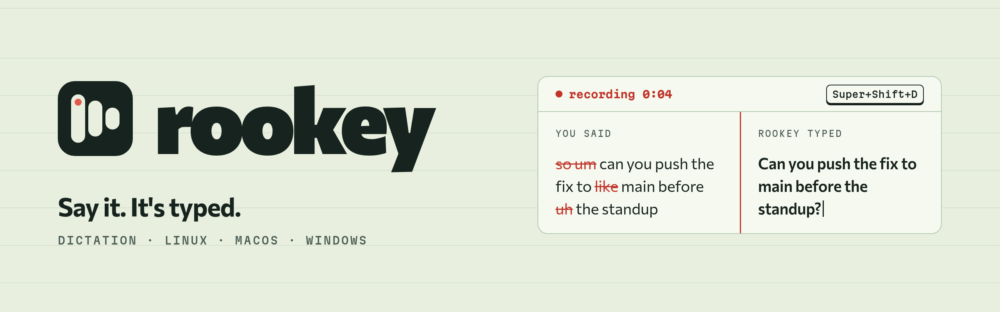

<p align="center">
  <a href="https://rookey.click">
    <picture>
      <source media="(prefers-color-scheme: dark)" srcset="assets/banner-dark.png">
      
    </picture>
  </a>
</p>

<p align="center">
  <a href="https://rookey.click"><b>rookey.click</b></a> ·
  <a href="https://github.com/7KiLL/rookey/releases/latest">Download</a> ·
  <a href="#settings">Settings</a> ·
  <a href="#hotkeys">Hotkeys</a> ·
  <a href="#backends">Engines</a>
</p>

<p align="center">
  <a href="https://github.com/7KiLL/rookey/releases/latest"></a>
  
  <a href="LICENSE"></a>
  
</p>

Hold a key, talk, let go: the text is typed into whatever window you are in. Whisper runs on your own machine, so nothing leaves it unless you pick a cloud engine. Filler words and false starts are dropped, the language is picked for you, and names on your screen, like `useSettingsStore`, come out spelled right.

## Install

```sh
curl -fsSL https://rookey.click/install | sh      # Linux, macOS
```
```powershell
irm https://rookey.click/install.ps1 | iex        # Windows, in PowerShell
```

Then, once:

```sh
rookey setup     # checks the mic, then a speech model to download, or an ElevenLabs key instead
```

The installers put the release build for your system on your PATH and nothing else. The speech model (1.6 GB for the default) is downloaded only when you pick it in `rookey setup`, and not at all if you use ElevenLabs. Other builds, and building from source: [Setup](#setup).

## Use

```
rookey            # record until Enter, print transcript (pipe it: rookey | wl-copy)
rookey -v         # show transcript text as it arrives (-vv: steps + timings, -vvv: every audio chunk)
rookey toggle     # 1st call: start recording. 2nd call: stop, transcribe, type into focused window
rookey listen     # Linux, Windows: hold ROOKEY_HOTKEY to talk, let go to stop (a tap keeps it going)
rookey ui         # settings page in the browser (--no-open just prints the link); `rookey setup` is the same page
```

## Settings

`rookey ui` opens a settings page: engine and Whisper models, language, cleanup, screen terms, the hotkey, and the keys of the providers. It is served from the rookey binary on 127.0.0.1 at a random port, fonts included, so it looks the same on every system and works offline. The link carries a one-time token, a saved API key is never sent back to the page, and the server stops when you close the tab. Comments and settings it doesn't know are left alone. It can also:

- download Whisper models, and list the ones already on disk (its own, and those of whisper.cpp and pywhispercpp)
- listen for the hotkey itself, or bind it on niri 26.04+ and Hyprland (see Hotkeys)
- record a test through the settings as they are, and show what came out instead of typing it

By hand: env vars, or `KEY=value` lines in `~/.config/rookey/config` (macOS: `~/Library/Application Support/rookey/config`). The environment wins, so `ROOKEY_BACKEND=local rookey` overrides the file for one run.

```
# ~/.config/rookey/config
ROOKEY_BACKEND=elevenlabs-realtime
ROOKEY_SANITIZE=1
ROOKEY_CONTEXT=1
ROOKEY_READER=openai
ROOKEY_EDIT=Fix the punctuation, drop filler words like "ну", "типа", "короче". Keep the language.
```

API keys have a file of their own, `~/.local/share/rookey/keys`, in the same format and readable only by you. It is outside `~/.config` on purpose: that is what dotfile managers sync and what ends up in public repos. A hotkey-spawned `rookey toggle` doesn't see your shell's env, so the file is where keys belong. A key an older rookey left in the settings file still works, and `rookey ui` moves it over when it starts.

```
# ~/.local/share/rookey/keys
ELEVENLABS_API_KEY=sk_...
OPENAI_API_KEY=sk-...
ANTHROPIC_API_KEY=sk-ant-...
```

| Setting | |
|---|---|
| `ROOKEY_BACKEND` | `local` (default), `elevenlabs`, `elevenlabs-realtime` |
| `ROOKEY_LANG` | `auto` (default), one language like `en`, or several like `en,uk`: the local engine picks the likeliest of them each time, ElevenLabs detects on its own |
| `ROOKEY_MODEL` | path to the ggml model (local backend) |
| `ROOKEY_SANITIZE=1` | drops filler words, false starts and non-speech sounds (Scribe `no_verbatim`, no extra cost). Whisper skips most of those anyway, so on `local` it only mutes non-speech tokens |
| `ROOKEY_EDIT=<instruction>` | free-form cleanup of the final transcript (Scribe `transcript_edit`, costs extra, experimental on realtime). ElevenLabs backends only. If the edit fails you get the transcript as it was |
| `ROOKEY_CONTEXT=1` | reads the screen when recording starts; the terms found on it bias the recognizer (Scribe `keyterms`, costs extra; whisper's initial prompt on `local`) |
| `ROOKEY_CONTEXT=<command>` | same, with the text taken from your command's stdout |
| `ROOKEY_READER` | who reads the screenshot: `ocr` (default, tesseract on this machine), `openai`, `anthropic` |
| `ROOKEY_READER_MODEL` | the vision model, if not `gpt-6-luna` or `claude-opus-5-5` |
| `ROOKEY_SCREENSHOT=<command>` | a command that prints the image, instead of `grim` |

### Screen terms

The screenshot is taken with `grim`, of the focused output on niri and Hyprland and of every output elsewhere. `rookey -vv` shows the terms that came out of it.

- `ocr`: tesseract reads it locally, in ~2 s while you talk. Only the picked terms leave the machine. It picks names written `like_this`, `likeThis` or `LIKE_THIS` and misses plain lowercase jargon.
- `openai`, `anthropic`: the screenshot itself goes to the provider, and a vision model lists the terms. Whatever is on the screen at that moment is in it.

ElevenLabs has no API that reads images, so it can't be a reader.

```
# a glossary of your own instead of the screen
ROOKEY_CONTEXT=cat ~/.config/rookey/glossary.txt
# macOS has no grim
ROOKEY_SCREENSHOT=screencapture -x -t jpg /tmp/rookey.jpg && cat /tmp/rookey.jpg
```

## Backends

Cloud backends (ElevenLabs Scribe, no local model needed), `ROOKEY_BACKEND=`:
- `elevenlabs`: uploads the clip when you stop (~1.5 s wait for 10 s of speech)
- `elevenlabs-realtime`: streams while you talk, shows live partials, ~0.3 s wait after stop

```
ROOKEY_BACKEND=elevenlabs-realtime ELEVENLABS_API_KEY=sk_... rookey
ELEVENLABS_API_KEY=sk_... cargo test -- --ignored   # live API tests on a sample clip
OPENAI_API_KEY=sk-... cargo test -- --ignored screen   # live test of the screen readers
```

## Setup

| Build | Runs on |
|---|---|
| `x86_64-linux-cuda` | an NVIDIA card with the CUDA 13 runtime installed (`libcublas.so.13`); the installer falls back to the CPU build without it |
| `x86_64-linux` | any x86_64 Linux |
| `aarch64-macos` | Apple silicon, on Metal |
| `x86_64-windows-cuda` | an NVIDIA card; the zip brings the CUDA runtime, the driver is enough |
| `x86_64-windows` | any 64-bit Windows 10 or 11 |

`ROOKEY_BUILD=cpu` (or `$env:ROOKEY_BUILD = "cpu"`) skips the CUDA build, `ROOKEY_VERSION=v0.1.0` picks a release. Models go to `<data_dir>/rookey/`: `~/.local/share/rookey`, `~/Library/Application Support/rookey`, `%APPDATA%\rookey` on Windows.

From source, with cmake and a C/C++ compiler (whisper.cpp is built too):

```
cargo install --path .                    # CPU
cargo install --path . --features cuda    # NVIDIA (needs nvcc on PATH)
cargo install --path . --features metal   # macOS
```

Releases: push a `v*` tag. `.github/workflows/release.yml` builds every archive above and writes the notes from the Conventional Commits since the last tag (`cliff.toml`).

## Hotkeys

There are two ways, and `rookey ui` keeps one at a time: with both, one press would start and stop the recording at once.

**rookey listens for it** (Linux and Windows, the default). `rookey listen` reads the keyboards through evdev, so it sees the key going up again, which compositor binds can't (niri has no release binds at all). Hold the keys to talk and let go to stop. A tap shorter than 0.3 s keeps it recording until the next press. `rookey ui` runs it as `~/.config/systemd/user/rookey-listen.service`, tied to `graphical-session.target`, and restarts it when the keys change. The keys go in `ROOKEY_HOTKEY`: a combination like `Super+Shift+D`, or a key on its own like `Control_R`, `Alt_R` or `F13`. It doesn't grab them, so the window you are in gets them too. Keys your compositor binds are reported first, and lone keys you press while typing (Shift, the left Ctrl, Alt, Super) are refused. It needs read access to `/dev/input`: the `input` group, or an ACL from your login manager.

On Windows it reads the keys' state instead, so it needs no rights of its own, and `rookey ui` starts it from your user's Run key (`rookey-listen`) at every login. The text is typed as Unicode key presses. A window running as administrator takes no input from rookey unless rookey runs as administrator too. Windows has no screenshot tool rookey knows: set `ROOKEY_SCREENSHOT` for screen terms.

**Your desktop runs it.** Bind `rookey toggle` in the compositor or anything else that runs a command. One press starts, the next one stops.

A sound plays as the recording starts and another as it stops, from the freedesktop sound theme (Windows: its own Speech On and Off sounds, and no notes on screen). `ROOKEY_QUIET=1` turns them off, and `ROOKEY_NO_NOTIFICATIONS=1` the notes on screen.

`rookey ui` sets the compositor bind where it can. Every change is checked by the compositor's own validator (`niri validate`, `Hyprland --verify-config`) and undone if that finds a fault. Keys that something else is bound to are reported first, with the line that binds them.

| Desktop | What `rookey ui` writes |
|---|---|
| niri 26.04+ | `rookey.kdl` next to your config, and one `include "rookey.kdl" optional=true` line in `user.kdl` if your config includes one, else in the main config |
| Hyprland | a marked block in `user.lua` if there is one, else in `hyprland.lua` (or `hyprland.conf` on a Hyprland older than 0.55) |
| older niri, macOS, others | nothing, the line to add is shown |

By hand, with `wtype` installed for typing the text:

```kdl
// niri, inside binds { }
Mod+Shift+D repeat=false { spawn "rookey" "toggle"; }
```
```lua
-- Hyprland
hl.bind("SUPER + SHIFT + D", hl.dsp.exec_cmd("rookey toggle"))
```

macOS: bind `rookey toggle` with skhd/Raycast/Shortcuts. The calling app needs Accessibility permission (it pastes via Cmd+V).

## Development

`just` lists the commands: `just install` builds, replaces `~/.local/bin/rookey` and restarts the hotkey listener, `just ui` does that and opens a fresh settings page, `just logs` follows the listener. `FEATURES=` builds without CUDA, `FEATURES=metal` for macOS.

## License

[Apache-2.0](LICENSE).
